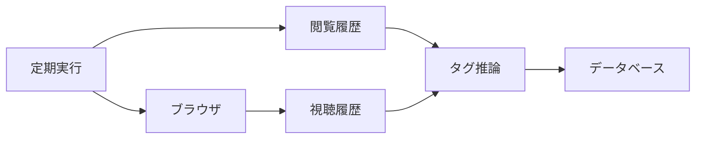

# brain-graph

A Claude Code Desktop Scheduled Task reads Chrome's history database and, through Claude
in Chrome, `youtube.com/feed/history` once a day, and appends a bipartite graph of URLs and
tags to Turso.

## Architecture

The pipeline has no server and no application code. A scheduled Claude Code session reads
both histories, infers tags, and writes rows over the Turso HTTP API. The two sources are
read differently: Chrome's history lives in a local SQLite file, while YouTube's exists
only on the signed-in page and is reached through the browser extension.



Everything the scheduled run does is described in [ingest.md](ingest.md), which is the
prompt itself rather than documentation about a prompt. The database shape lives in
[schema.sql](schema.sql). Those two files are the whole system.

## Graph Model

The graph is bipartite: URLs on one side, tags on the other, and a single edge type joining
them. Two URLs are related when they share tags, and two tags are related when they share
URLs, so both similarity notions are queries over one edge table rather than stored data.

| Table | Holds |
| :-- | :-- |
| `urls` | One row per distinct URL, with its title and the window it has been seen in |
| `tags` | The tag dictionary, one row per unique name |
| `has_tag` | The only edge, carrying its source and a confidence score |
| `visits` | Append-only visit events, many per URL |
| `ingest_state` | The high-water mark of the last successful run, per source |

Derived edges such as `similar_url` and `co_tag` are deliberately absent. They are
recomputable from `has_tag` with a join, they would need invalidation on every write, and
nothing yet reads them. Adding them before a query demands them would be storage bought
against a guess.

## Setup

Four steps stand between an empty machine and a graph that grows on its own.

### Prerequisites

Claude Code on a Pro or Max plan provides the scheduled task runner, the Claude in Chrome
extension provides the browser access, and a Turso account provides the database. Install
and sign in to all three before continuing.

### Database

Create the database, then read back the values the ingest run needs.

```bash
turso db create brain-graph
```

```bash
turso db show brain-graph
```

```bash
turso db tokens create brain-graph
```

Apply the schema to the new database.

```bash
turso db shell brain-graph < schema.sql
```

### Credentials

Store the endpoint and the token outside this repository. The scheduled task has no
environment of its own, so the ingest run reads this file directly.

```bash
mkdir -p ~/.config/brain-graph && printf 'TURSO_DATABASE_URL=libsql://...\nTURSO_AUTH_TOKEN=...\n' > ~/.config/brain-graph/env && chmod 600 ~/.config/brain-graph/env
```

### Schedule

Open Claude Code, ask it to create a daily scheduled task at 3am, and paste the contents of
[ingest.md](ingest.md) as the task prompt. The task runs while the desktop app is open; if
the app is closed when the task is due, it runs at the next launch.

Run it once by hand before trusting the schedule. Reading Chrome's history file is blocked
by default as personal data, so the first run raises a permission prompt and you must add
the Bash rule it suggests; an unattended run cannot answer that prompt and would leave the
Chrome half of the graph permanently empty. The first run also needs the Claude in Chrome
extension connected and YouTube signed in.

## Privacy

This repository is public and holds no collected data. Credentials stay on the local
machine, sensitive URLs are filtered before they reach the model or the database, and
recorded data can be deleted by URL pattern. See [docs/privacy.md](docs/privacy.md).

## Development

Branching follows git-flow. `main` carries production state, `develop` integrates work, and
short-lived `feature/*`, `release/*`, and `hotfix/*` branches are cut from and merged back
by the `git flow` commands.

```bash
git flow feature start add-tag-confidence
```

Branch descriptions are kebab-case English verb phrases of two to five words, naming the
change rather than the author or the date.

## License

MIT. See [LICENSE](LICENSE).
